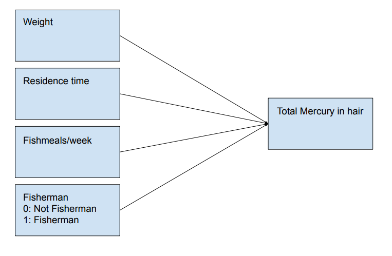

### Conceptual model

Underlying the research question is that the amount of fish consumed by fishermen in Kuwait as well as factors such as their residence time, fishmeals consumed/week and weight have an impact on the amount of mercury in their hair.
We here show our model:
Our independent variables are Fisherman, residence time, fishmeals/week and weight. The dependent variable is the Total mercury in the fishermans hair.




### Visual inspection of the Data
We perform a Graphical analysis of the data by visualizing properties of the data such as the distribution of the dependent variable and checking for normality assumptions.


```{r include=FALSE}
# Question 2.3: Linear regression
library(foreign) #open various data files
library(car) #Package includes Levene's test 
library(tidyr)  # for wide to long format transformation of the data
library(ggplot2)
library(QuantPsyc) #include lm.beta()
library(gmodels)
library(pander) #for rendering output
library(ez) #for ezANOVA
library(lmtest)
```

```{r}
# Getting Data:
fisherM<-read.csv("fishermen_mercury.csv", header = TRUE)
fisherM$fisherman<-factor(fisherM$fisherman, levels =c(0:1), labels =c("NotFisherman","Fisherman"))
fisherM$fishpart<-factor(fisherM$fishpart, levels =c(0:3), labels =c("none","muscle tissue", "mt or whole", "whole"))
```

```{r}
# Analysing Data:
qqnorm(fisherM$TotHg)
```


Performing a QQ plot analysis to check for normality shows a large deviation from a straight line at the ends of the plot, this shows that the distribution is non-normal

```{r}
hist(fisherM$TotHg, 20, col="black")
```


```{r}
d<-density(fisherM$TotHg)
plot(d)
```


The histogram  and density plot do seem to resemble somewhat a normal distribution, but the long tail at the higher Mercury values shows that it is most likely not normally distributed.

```{r}
shapiro.test(fisherM$TotHg)
```

```{r}
shapiro.test(fisherM$fishmlwk)
```

```{r}
shapiro.test(fisherM$restime)
```

```{r}
shapiro.test(fisherM$weight)
```

The p values of most Independent Variables is less than 0.05 meaning that the null hypothesis of the data being normal can be rejected. Only the weight has a p value of >0.05 which shows that it is normally distributed, which intuitively makes sense.


### Scatter plots Dependent and Independent variables
We want to find if there is some relation between the dependent and independent varibale and how big this relation might be. For this we show scatter plots between dependent variable and the independent/predictor variables


```{r}
# Scatterplots:
boxplot(TotHg~fisherman, data = fisherM,main="Plot between if fisherman or not")
```


The boxplot shows that pretty much all of the outliers of people with elevated mercury levels are indeed fishermen, leading to think that there is indeed some relation between having elevated levels and being a fisherman. Besides this it is worth noting that the standard deviation of the values for the fishermen is substantially larger than for the non fishermen. Important to take into account is that there is an imbalance of sample population as the amount of fishermen is 100 and non fishermen 35.

```{r}
boxplot(TotHg~fishpart, data = fisherM,main="Plot between parts of fish")
```


Additionally we checked whether eating a certain part of the fish would have an effect, even though we did not take this as an idependent variable in the model. Even though the values for muscle tissue look to have a larger standard deviation and mean, overall it does not seem to have much of a relation.

```{r}
plot(TotHg~restime, xlab="Residence time in years", ylab = "Total Mercury", data = fisherM,main="Scatterplot between Residence time and TotHg")
```


From the plot the residence time does not seem to have a relation on the mercury levels.

```{r}
plot(TotHg~fishmlwk, xlab="Fish meals per week", ylab = "Total Mercury", data = fisherM,main="Scatterplot between Amount of fish meals and TotHg")
```


The fishmeals consumed seems to have a linear relation, especially at the lower values, however the relation still looks fairly weak.

```{r}
plot(TotHg~weight, xlab="Weight", ylab = "Total Mercury", data = fisherM,main="Scatterplot between Weight and TotHg")
```


The weight does look to have a relation with the total mercury in the persons hair, which makes sense as the amount of mercury would be more if the person has more mass overall.


### Linear regression analysis
We conduct a multiple linear regression analysis and try to find those independent variables that look to have a significant impact.


```{r}

# Linear models:

model0 <-lm(TotHg~1 , data = fisherM, na.action = na.exclude)
model1 <-lm(TotHg~weight  , data = fisherM, na.action = na.exclude)
model2 <-lm(TotHg~fishmlwk , data = fisherM, na.action = na.exclude)
model3 <-lm(TotHg~restime , data = fisherM, na.action = na.exclude)
model4 <-lm(TotHg~weight+fishmlwk , data = fisherM, na.action = na.exclude)
model5 <-lm(TotHg~weight+restime , data = fisherM, na.action = na.exclude)
model6 <-lm(TotHg~fishmlwk+restime , data = fisherM, na.action = na.exclude)
model7 <-lm(TotHg~weight+fishmlwk+restime , data = fisherM, na.action = na.exclude)
modelfisherman <-lm(TotHg~fisherman+weight+fishmlwk+restime  , data = fisherM, na.action = na.exclude)
```

We plot the scatterplots with the corresponding trendline now. This further seems to confirm the earlier conclusions made about the relations of the data variables with the mercury levels. Only weight and fishmeals/week seem to have some linear relation.

```{r}
#scatterplots with fitted lines 
plot(TotHg~weight, xlab="Weight", ylab = "Total Mercury", data = fisherM,main="Scatterplot between Weight and TotHg")
lines(fisherM$weight, fitted(model1), col="blue")
```


```{r}
plot(TotHg~fishmlwk, xlab="Fish meals per week", ylab = "Total Mercury", data = fisherM,main="Scatterplot between Amount of fish meals and TotHg")
lines(fisherM$fishmlwk, fitted(model2), col="blue")
```


```{r}
plot(TotHg~restime, xlab="Residence time in years", ylab = "Total Mercury", data = fisherM,main="Scatterplot between Residence time and TotHg")
lines(fisherM$restime, fitted(model3), col="blue")
```


```{r}
pander(anova(model0, model1, model2, model3, model4, model5, model6, model7, modelfisherman))
```


Looking at the anova table only the models including the weight variable seem to have a significantly high F statistic value with the highest being model4 with weight and fishmlwk (43.65). For these models we can reject the null hypothesis meaning there is a relevant relation. 

```{r}
pander(summary(modelfisherman))
```


From the table we can say that for the weight and fishmlwk variables the null hypothesis of there being no effect can be rejected, meaning that there is some relation between the amount of fish meals consumed and the mercury levels when considering the full model. Additionally as also assumed earlier, the weight has an effect. Being a fisherman looks to not have an effect, this is reasonable since most of the people with elevated levels were fishermen, but a majority of the fishermen also had no elevated levels, meaning that the two do not necessarily have any correlation.

```{r}
pander(summary(model4))
```

```{r}
pander(anova(model4))
```

```{r}
pander(lm.beta(model4))
```
From the Beta values of the model we can see that the impact of the weight variable is greater. The Beta value of weight is greater which means that a unit increase in the weight will have a greater increase in the Total amount of mercury.


Looking also at the impact of the individual predictors on the fit:

```{r}
pander(anova(model0, model1))
```

```{r}
pander(anova(model0, model2))
```


```{r}
pander(summary(model7))
```

```{r}
pander(lm.beta(model7))
```

```{r}
pander(confint(model7))  
```
The confidence interval values can be interpreted such that with a 2.5% chance the values will be lower than the given value for the variable and with 97.5% it will be lower than the value given in that column. meaning that with a 95% chance the value of the parameter will be between the given values.

The above results further strengthen the idea that mostly the weight and fishmeals has an impact. The residence time weights are negligible. The R and R squared values are fairly low, meaning that the data variance is spread quite wide around the fit line. This shows that even though there is a relation between the variables there is still a large variance for the individual cases around the fit.

### Examine assumption
We examine the assumptions underlying linear regression. 

We want to test the assumptions underlying the regression model. We test this on the model with the variables that were relevant in the previous analysis so weight and fishmlwk.
We want to look at the assumptions of:
Multicolinearity of predictors: we want to see if the predictors within the model have correlations with each other. If there exist correlations between predictors this can give trouble with knowing the impact of individual predictors. we can check this by looking at the variance inflation factor(vif) or tolerance (1/vif).
Autocorrelation between the errors: we want to check whether the errors are independet meaning there is no correlation. This can be checked with the Durbin Watson Test with the null hypothesis that there is no correlation among residuals.
Visual inspection of residuals: We want to check that the residuals are normally distributed as well as seeing if there would be a pattern between the residuals and the fitted values. For the regression assumptions to hold the residuals should be normally distributed and the residuals vs fitted values should show no pattern.


```{r}
# Assumptions:
1/vif(model4)
```

A tolerance value of > 0.2 like we see shows that there is no big multicolinearity problem.

```{r}
durbinWatsonTest(model4)
```


If we use a threshold of p value < 0.05  the DW test shows that the null hypothesis can be rejected, meaning there is some colinearity between predictors. The D-W statistic, however still shows not too big reason for concern. Good values would be around 1.5-2.5, in our case it is on the edge but still within a reasonable range.

```{r}
hist(model4$residuals)
```


```{r}
hist(rstudent(model4))
```


```{r}
shapiro.test(model4$residuals)
```


Another assumption of the regression model is that the residuals are normally distributed. However, looking at the residual plots and the p value for the shapiro-wilk test we can say that the residuals are not normally distributed.

```{r}
plot(model4$residuals, model4$fitted)
```


From the scatterplot it is clear that there is no pattern or relation between the residuals and fitted values.

```{r}
fisherM$fitted.Hg <-fitted(model4)
pander(head(fisherM[, c("weight","fishmlwk","fitted.Hg" )], n=20L), 
       caption = "Last 20 cases and their fitted values")
```


### Impact analysis of individual cases
We examine the effect of single cases on the predicted values (e.g. DFBeta, Cook's distance)

We want to look at the impact of extreme values on the fitted values. For this we want to look at the hatvalues and see if the values have a high leverage. We take the average leverage as having to be around (#predictors + 1)/#observations. which in our case would be 2+1/135= 0.022. we want to investigate those cases that are 3 times the average leverage.

```{r}
# Individual Cases:
#residuals
fisherM$stud.res<-rstudent(model4)
fisherM$dfbeta<-dfbeta(model4)
fisherM$leverage<-hatvalues(model4)
fisherM$cooks<-cooks.distance(model4)


troublingdata<-subset(fisherM, (leverage > 3*.022) | (abs(stud.res) > 2), 
                      select = c("leverage", "stud.res", "dfbeta"))

head(troublingdata)
```


We also plot the Residuals vs the leverage, there would be reason for concern if a point is above the dotted red line in the top right. However as can be seen in the plot below this is not the case.
```{r}
plot(model4, which=5)
```


### Report section scientific publication

Taking the results of the model comparison and the analyses performed on these models we can report the results as follows. A linear model was fitted based on the amount of Total mercury in a hair of a Kuwaiti person. Taking being a fisherman, residence time, fishmeals in a week and weight as independent variables. The analysis found a significant main effect for the model including the weight and the amount of fishmeals per week (F(1,132) = 43.65  , p = 9.15e-10). 
The relevant predictors that have shown to have an impact are weight(F(1,133)=26.76, p= 8.281e-07) and fishmeals/week(F(1,133)=13.44, p= 0.0003557). where the mean and standard deviation for the relevant independent variables and the dependent variable are weight(mean:73.15556,  std:6.673479) fishmeals/week(mean:6.525926,  std:5.310971) Total mercury(mean:3.775304, std:2.938538).
For the model including the fisherman variable it found no significant main effect (F(1,132) = 2.961  , p = 0.08768). An analysis of the assumptions made for the linear regression model does show that the model fails to uphold some assumptions such as normality of data and normality of residuals.
